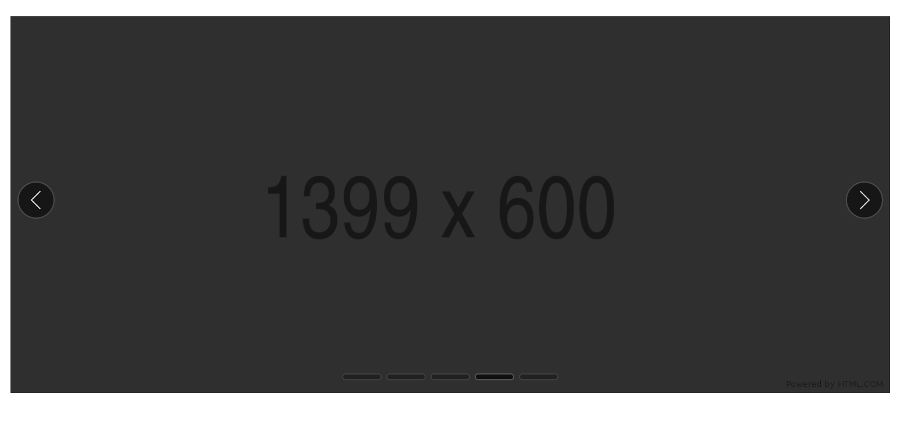

# Carousel

## Overview

As defined by the W3C:
> A carousel [aka Slideshow, Image Rotator] presents a set of items, referred to as slides, by sequentially displaying a subset of one or more slides. Typically, one slide is displayed at a time, and users can activate a next or previous slide control that hides the current slide and "rotates" the next or previous slide into view. In some implementations, rotation automatically starts when the page loads, and it may also automatically stop once all the slides have been displayed. While a slide may contain any type of content, image carousels where each slide contains nothing more than a single image are common.
>


### Use Cases

- Jeff is looking for an apartment and wants to see what the apartment looks like, so he clicks on the main image and a carousel appears allowing him to rotate through the images of the apartment.

- Jess is checking out the latest news from her favorite website and quickly sees the main headlines of the day at the top of the webpage as they rotate headline by headline across the page.

### Features

- **Next and Previous Controls:** Simple buttons [aka flippers] that allow for control of displaying the next and previous slides.

- **Slide Picker:** A control or group of controls that allows the specific choice of slide to display.

- **Autoplay:** Allows the carousel to begin rotating through slides automatically after the carousel loads. Autoplay can be toggled on/off with a button, and automatically stops when any element in the carousel receives keyboard focus or is hovered over.

- **Looping:** Allows the user to navigate from the first slide to the last if the previous flipper is activated. If on the last slide the user can navigate from the last slide to the first when the next flipper is activated.


### Risks and Challenges

*Notable risks or challenges associated with implementing the component. Would we need to make any breaking changes in order to achieve this component's goals?*

### Prior Art/Examples
- [FAST-DNA (React)](https://explore.fast.design/components/carousel)
- [W3C](https://w3c.github.io/aria-practices/examples/carousel/carousel-1.html)

---

## Design

### API

*Component name:*
- `fast-carousel`

*Attributes & Properties:*
- `autoplay` - boolean value to toggle if the carousel plays on load or not (defaults to false)
- `autoplay-interval` - a number representing the autoplay interval in milliseconds
- `loop` - boolean value to toggle if the carousel loops slides at the beginning or end (defaults to true)
- `aria-labelledby` - optional based on implementation**
- `aria-label` - optional, based on implementation**
- `paused` - whether the rotation is paused or not

** See the [W3C Specification](https://w3c.github.io/aria-practices/#wai-aria-roles-states-and-properties-4) for requirements and details.

*CSS custom properties:*
- ???

*Slots:*
- `default` - slot for slides content // TODO: IS this the right way?
- `play-toggle` - the control to toggle if the slides rotate or not
- `next-flipper` - the control used to rotate to the next slide
- `previous-flipper` - the control used to rotate to the previous slide
- `tablist` - the control to select a certain slide

*Events*
- `rotate` - callback fired when the a slide rotates. The play/pause state can then be read by the author from the reference element, e.g. event.target.paused

### Anatomy and Appearance
**Carousel Structure:**

Notes:
- (1) The Carousel class will have a method that checks the attribute names and grabs the items.
- (2) Since the host element has the handleClick(), it would use event delegation to check what element was clicked on. Example: If the target was an element with a `[slot="next-flipper"]` it would trigger the controller method for nextSlide(). This way each element passed in via slot would not needs it's own onClick.
- (3) A slot can have multiple elements associated with it.


```html
<template>
    <div
        class="carousel"
        aria-roledescription="carousel"
        tabindex="-1"
        @click="${x => x.handleClick()}" // See note (2)
    >
    
    <slot name="item">Slide content / items go here</slot>

    <slot name="play-toggle"> SEE DEFAULT </slot>
    <slot name="next-flipper"> SEE DEFAULT </slot>
    <div
        class="carousel-items"
        aria-live="off"
    >
        <!-- Solution 1 -->
        <!-- Map all items and use css class's to display correct item based on id. -->
        <!-- May be a less performant way as the items will be mapped each time. -->
        ${ x => x.items.map(item, index => {
            return `
            <div
                class="carousel-item ${x => x.getActiveIndex() === index ? 'active' : ''}"
                role="group"
                aria-roledescription="slide"
                aria-label="${x => x.getActiveIndex()} of ${x => x.getItemCount()}"
            >
                ${item}
            </div>`
            }).join('')
        }
        <!-- Solution 2 -->
        <!-- Have carousel class method that query selects this div and inserts content for the correct item based on id/index from the id's given as an array. -->
        <div
            class="carousel-item"
            role="group"
            aria-roledescription="slide"
            aria-label="${x => x.getPreviousIndex()} of ${x => x.getItemCount()}"
        >
            ${x => x.getItem(x.getPreviousIndex()}
        </div>
        <div
            class="carousel-item"
            role="group"
            aria-roledescription="slide"
            aria-label="${x => x.getActiveIndex()} of ${x => x.getItemCount()}"
        >
            ${x => x.getItem(x.getActiveIndex())}
        </div>
        <div
            class="carousel-item"
            role="group"
            aria-roledescription="slide"
            aria-label="${x => x.getNextIndex()} of ${x => x.getItemCount()}"
        >
            ${x => x.getItem(x.getNextIndex())}
        </div>
    </div>
    <slot name="previous-flipper"> SEE DEFAULT </slot>
    <slot name="tab-list">SEE DEFAULT </slot>
    </div>
</template>
```

**Default Flipper**
```html
<button
    class="next-flipper"
>
    <svg class="flipper-svg">
        <path d="example path..."></path>
    </svg>
</button>
```

**Default Play Toggle**
```html
<button
    class="previous-flipper"
>
    <svg class="play-svg">
        <path d="example path..."></path>
    </svg>
</button>
```

**Default Tab List**
```html
<div role="tablist" class="tablist" aria-label="A carousel of items">
    <div tabindex="0" role="tab" class="tablist-tab"></div>
    <div tabindex="-1" role="tab" class="tablist-tab"></div>
    <div tabindex="-1" role="tab" class="tablist-tab"></div>
    <div tabindex="-1" role="tab" class="tablist-tab"></div>
    <div tabindex="-1" role="tab" class="tablist-tab"></div>
</div>
```

**Implementation**
```html
<body>
    <fast-carousel
        autoplay="true"
        autoplay-interval="6500"
        loop="true"
        paused
        aria-labelledby
        aria-label

        
        <p slot="item"> Lorem ipsum... </p> 
        <div slot="item"> some elements... </div>

        <button
            slot="next-flipper"
            class="next-flipper"
        >
            <svg class="flipper-svg">
                <path d="example path..."></path>
            </svg>
        </button>

        <button
            slot="previous-flipper"
            @click="${x => x.next()}"
            class="previous-flipper"
        >
            <svg class="flipper-svg">
                <path d="example path..."></path>
            </svg>
        </button>

        <button
            slot="play-toggle"
            @click="${x => x.togglePlay()}"
            class="previous-flipper"
        >
            <svg class="play-svg">
            <path d="example path..."></path>
            </svg>
        </button>

        <div role="tablist" class="tablist" aria-label="A carousel of items">
            <div tabindex="0" role="tab" class="tablist-tab"></div>
            <div tabindex="-1" role="tab" class="tablist-tab"></div>
            <div tabindex="-1" role="tab" class="tablist-tab"></div>
            <div tabindex="-1" role="tab" class="tablist-tab"></div>
            <div tabindex="-1" role="tab" class="tablist-tab"></div>
        </div>
    >
    </fast-carousel>
</body>
```

**Appearance:**
| State | Image |
| ----- | ----- |
| default |  |
| dark mode |  |

Parts:
- carousel - the container for all the elements
- carousel-item - the container for an item as content

Animation:

// TODO: ??? Same as Dialog or others?

---

## Implementation

### States

*Key component states, valid state transitions, and how interactions trigger a state transition.*

- `paused` - if the carousel slide rotation is paused
- `activeSlideElement` - Holds a reference to the HTMLElement currently that is the active slide.

### Accessibility

The carousel should align to the design pattern and interaction model provided by the W3C: https://w3c.github.io/aria-practices/#carousel

### Globalization

The component may have to change the order of rotation for slides as an RTL users sequence expectations is reversed from LTR. This would require that the flippers and tablist be functionally reversed. The tablist would also have to be visually reversed with the first tab item starting on the right of the tablist.

### Test Plan


### Performance


### Documentation

This will most likely require some extra documentation to make the implementation clear for the developer.

---

## Resources

[W3C Spec](https://w3c.github.io/aria-practices/#carousel)

[W3C Accessible Carousel Example](https://w3c.github.io/aria-practices/examples/carousel/carousel-1.html)

[MDN Web Components Editable List Example](https://github.com/mdn/web-components-examples/tree/master/editable-list)
